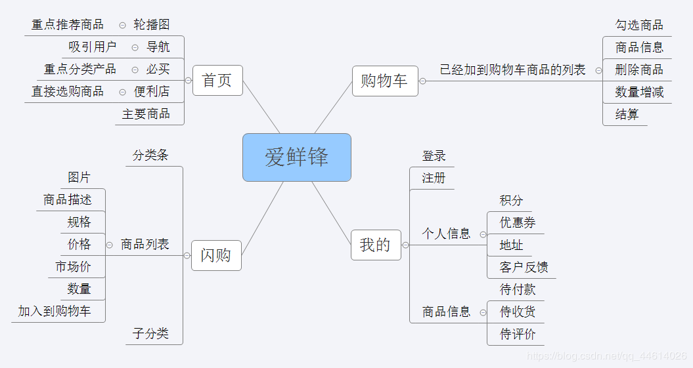
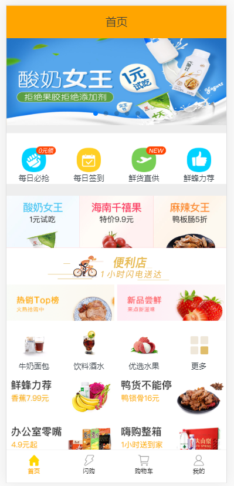
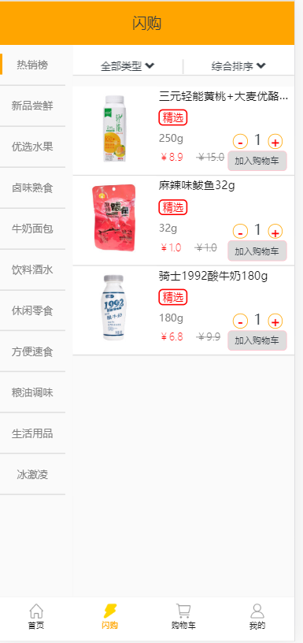
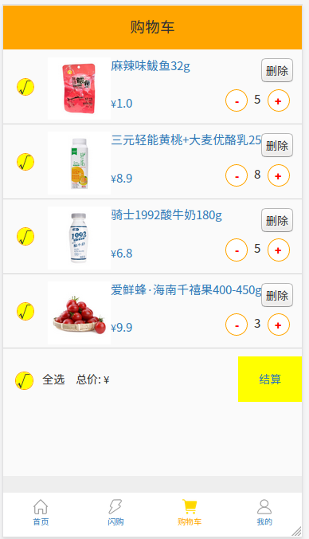
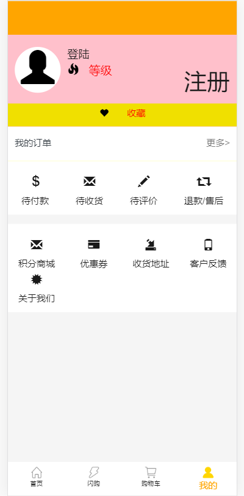
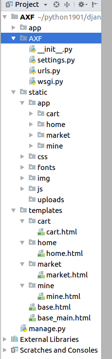
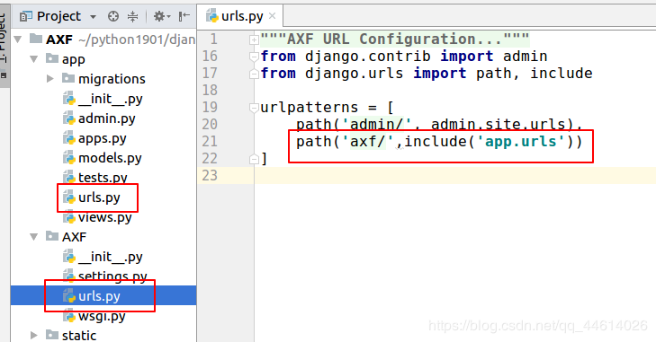
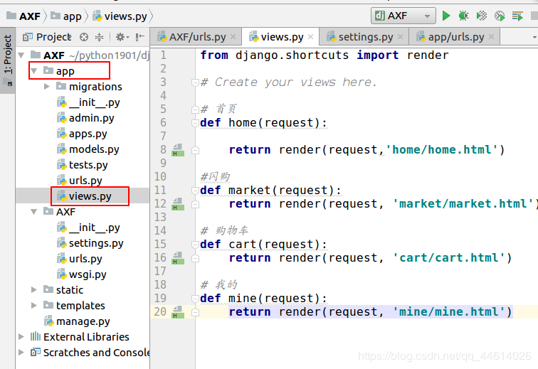
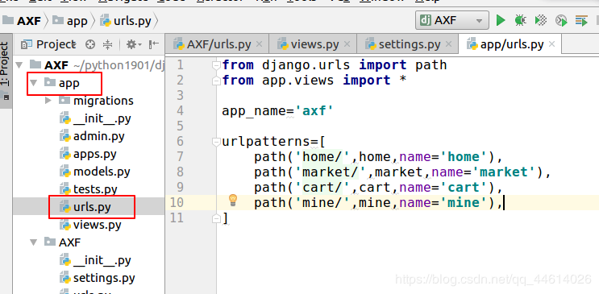

# 1.软件开发的一般流程


## 1.需求分析及确认：

由需求分析工程师与客户确认甚至挖掘需求。输出需求说明文档。

## 2.概要设计及详细设计：

开发对需求进行概要设计，包括系统的基本处理流程，组织结构、模块划分、接口设计、数据库结构设计等。然后在概要设计的基础上进行详细设计。详细设计中描述实现具体模块所涉及到的主要算法、数据结构、类的层次结构及调用关系，需要说明软件系统各个层次中的每一个程序(每个模块或子程序)的设计考虑，以便进行编码和测试。基本达到伪代码的层面。 (原型图)

## 3.编码：

根据详细设计文档进行编码。在实际的项目开发中，编码是占时间最少的。

## 4.测试：

一般有专业测试团队进行测试。

## 5.发布或上线：

提供各种文档，比如杀毒软件扫描文档，安装手册，操作指南等一系列文档资料打包与程序一起发布。当然后续还会有验收和维护等操作。

# 2.企业常见开发模式

## 1.瀑布式模型:

瀑布模型式是最典型的预见性的方法，严格遵循预先计划的需求分析、设计、编码、集成、测试、维护的步骤顺序进行。瀑布式的主要的问题是它的严格分级导致的自由度降低，项目早期即作出承诺导致对后期需求的变化难以调整，代价高昂。瀑布式方法在需求不明并且在项目进行过程中可能变化的情况下基本是不可行的。

## 2.迭代式开发 （目前公司用的较多的开发模式）

每次只设计和实现这个产品的一部分；
逐步逐步完成的方法叫迭代开发；
每次设计和实现一个阶段叫做一个迭代.
在迭代式开发方法中，整个开发工作被组织为一系列的短小的、
固定长度（如3周）的小项目，被称为一系列的迭代。
每一次迭代都包括了需求分析、设计、实现与测试。

## 3.敏捷开发（比较热门的开发模式）

和迭代式开发类似，敏捷开发的周期可能更短，并且更加强调队伍中的高度协作。一个小功能叫做一个story。开发人员要完成stroy文档的编写。

# 3.爱鲜蜂项目架构搭建



这是一个手机端的应用,以下是项目的效果图,分为首页,闪购页,购物车页,个人信息页四大模块,这个项目这里主要是写后端,通过一些接口,把数据返回给前端,所以项目一般流程的ui设计,前端设计等在这里基本都没有,前端的css,js框架等,有从bootstrap网站上下载引用的,很多都是已给定的,如果按基本流程开发,这个项目要1~3个月左右时间,这只是一个前后端不分离的小项目,这里只实现一些常用的功能.










如果没有登陆的话,购物车应该不显示出来,默认显示为登录页

## 3.1 创建项目

这里是在虚拟机的终端创建的 (看自己想法,也可在pycharm直接创建) 第一步要先进入虚拟环境下,如果是在公司,一般情况下每个项目都会独立的环境的配置,这里只是练习,不做要求,使用的是平常用的python3.5的环境
可能要用到的包(之前在环境下都安装过)
Django == 2.2.1
mysqlclient == 1.4.2.post1
Pillow == 6.0.0
PyMySQL == 0.9.3
SQLAlchemy==1.3.3

```python
进入虚拟环境下
workon env3   
创建项目
django-admin startproject AXF
```


## 3.2 创建App

```pythhon
使用pycharm打开AXF项目 打开pycharm终端  创建App
    python manage.py startapp App
```


## 3.3 项目配置

创建一个mysql数据库

```python
在虚拟机终端输入命令
mysql -u 用户名 -p 输入密码
创建一个新的数据库 AXF 一定要写utf8 ,支持中文
create database AXF charset utf8;
可以看一下创建是否成功
show databases;
看一下创建的数据库是否在里
```


setting文件的配置

```python
打开settings.py进行如下配置

1，设置允许主机为所有， ALLOWED_HOSTS = ["*"]

2，在INSTALLED_APPS中注册App 

3,  在项目根目录下创建templates目录，并在settings.py中TEMPLATES给DIRS添加路径

配置公用模板

​```
    'DIRS': [
        os.path.join(BASE_DIR,'templates')
    ],
​```

4,  在mysql中创建新数据库axf, 并配置数据库为mysql, 

​```
DATABASES = {    
	'default': {        
		'ENGINE': 'django.db.backends.mysql',       
	 	'NAME': 'axf',       
		'HOST': '127.0.0.1',        
		'PORT': '3306',        
		'USER': 'root',        
		'PASSWORD': 'root',    
	}
}
​```

5,  设置语言为中文：
	LANGUAGE_CODE = 'zh-hans'

6,  设置时区：
	TIME_ZONE = 'Asia/Shanghai'

7,  配置静态文件和媒体文件目录
	7.1 在根目录下创建static目录， 并在static目录中创建uploads目录
	7.2 在setting.py中配置
		STATICFILES_DIRS = [
			os.path.join(BASE_DIR, 'static'), 
		]
		MEDIA_ROOT = os.path.join(BASE_DIR, 'static/uploads')
```


## 3.4目录结构

### static目录

根据项目需求在static目录中创建以下目录:
应用目录app
样式目录css
字体目录fonts
图片目录img
脚本文件目录js
媒体文件目录uploads
且在app目录下针对每个功能模块分别创建以下目录，分别存放每个功能模块的静态文件
首页home
闪购market
购物车cart
我的mine

### templates目录

根据项目需求在templates中创建以下目录和文件, 分别存放每个功能模块的HTML文件模板,再创建两个特殊的html文件
首页home
闪购market
购物车cart
我的mine
基础模板: base.html
主体模板: base_main.html
如图所示



## 3.5 App和url的配置

在App中创建并配置urls.py文件，并配置好工程urls.py的路由规则



在app的views.py文件下去创建视图函数.
这个应用下有这四大专栏,先将这个框架先搭出来,渲染到html页面上



根据视图函数在app下的urls.py文件下去导入path



这样项目基本的配置ok了

# 4 复制虚拟环境中的包

整个项目完成后 (现在还只是搭了个基本框架) 可将虚拟环境配置的包复制到一个文件中,方便项目转移和虚拟环境的配置

```python
在旧环境中使用：pip freeze > a.txt
在新环境中使用：pip install -r a.txt
```


一些前端的框架,静态文件,可在网上找,方便后端开发
Swiper :
https://www.swiper.com.cn/
Bootstrap:
https://v3.bootcss.com/
