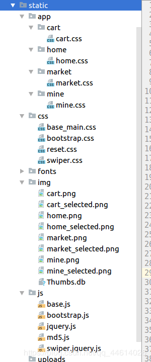
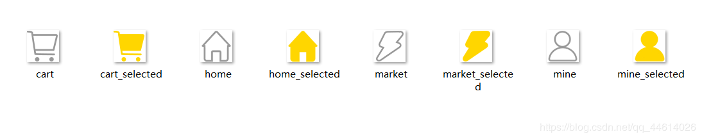
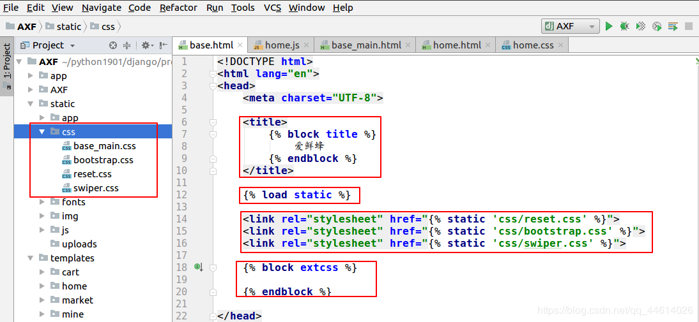
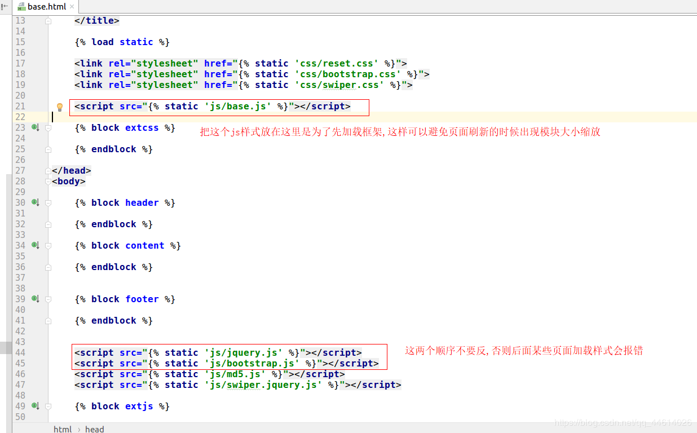
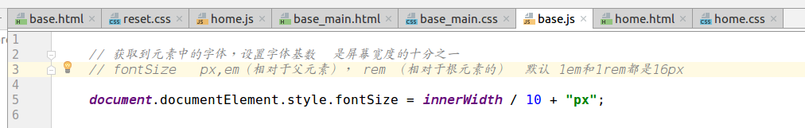
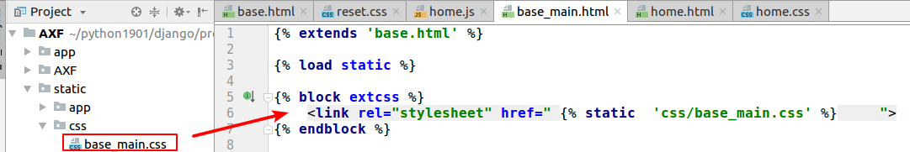
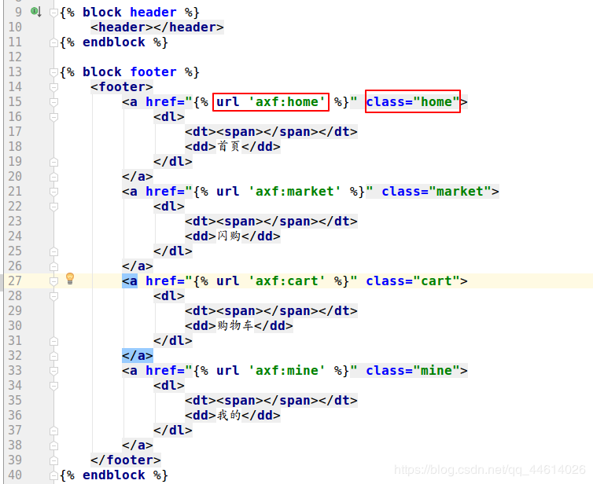
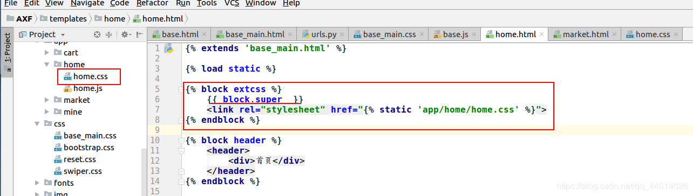
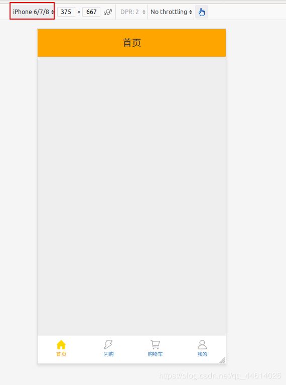
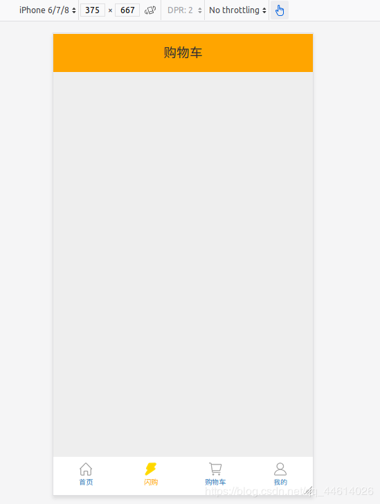

# 现在先将底部专栏写好,搭好基本的框架

# 1. 将网上下载的静态文件导入

咳咳,我们这里主要是写后端的内容,前端的就敷衍一下,每一步都会有一些相应的解析,但不做详解

img文件夹这里放的是是底部专栏的一些图片,点击时变色,跳转到相应的页面

# 2.在基础模板base.html文件中引入静态文件,’‘挖坑’’,供其他模板’‘填坑’’(继承)

title以 ‘‘挖坑’’ 方式写是为了在其他页面的时候网页标题也是显示 ‘‘爱鲜蜂’’
在头部引入static文件夹下的3个css文件,
最后挖个坑,供子模板文件在其自身能继续引入css文件

在body挖3个坑, 头部 ,中间 ,和尾部 ,供子模板继承
引入js文件,同样挖个坑,供子模板能继续引入js

这里先解释一下base.js文件,也就是说,接下来所有的css文件里的rem,都是相对于此模板而言

# 3.主体模板base_main.html继承基本模板base.html的内容,同时搭建底部专栏

继承模板,引入静态文件下的css文件(这个称为填坑)

搭建底部专栏,这里可以联想一下淘宝app的底部栏,点击底部栏时,底部栏只是点击部位会变色,跳转到相应的页面,所以说底部栏是一个公共的模块(顶部也类似),所以将底部和顶部都放在此模板内

这里的 url ‘axf:home’ 其实是一个url的反向解析,(按住crtl键鼠标点击home,会跳转到app目录下的urls.py文件下的视图函数),详情可了解Django的url反向解析
class=’’ home’’ 这里只是给 a 标签一个相当于标识的作用,各一个权重

查看一下这里的base_main.css文件,这里并不做过多解析,可以通过标签查看底部栏的css样式,点击对应部位变色,且跳转到相应的界面

为了更好的查看页面效果,顺便先把首页,购物车页,闪购页和个人信息页的头部写一下,这里以首页home.html为例,其他页面类似,只需要改一下参数

首先,继承base_main.html模板, block.super的意义是不覆盖父模板的css样式
查看效果,运行这个项目,进入浏览器,打开浏览器的调试模式

框框部位可更换手机型号,更换后有时会显示大小不正常,刷新一下页面
点击底部栏,查看效果,正常

文件连接
链接：https://pan.baidu.com/s/1og28FtyODJsQPqPLfOb5Uw
提取码：8no4