# 在框架上搭好基本的页面

# 1.home页面

## 1.1插入轮播图

前面也说过,这个项目中很多的前端内容都是写好的,只是作为引用.前端的 css, js 框架很多都是引用bootstrap网站上的,可进入此网站去查看一下框架,组件等内容

首先,去实现一下轮播图的功能,

### 加载js文件

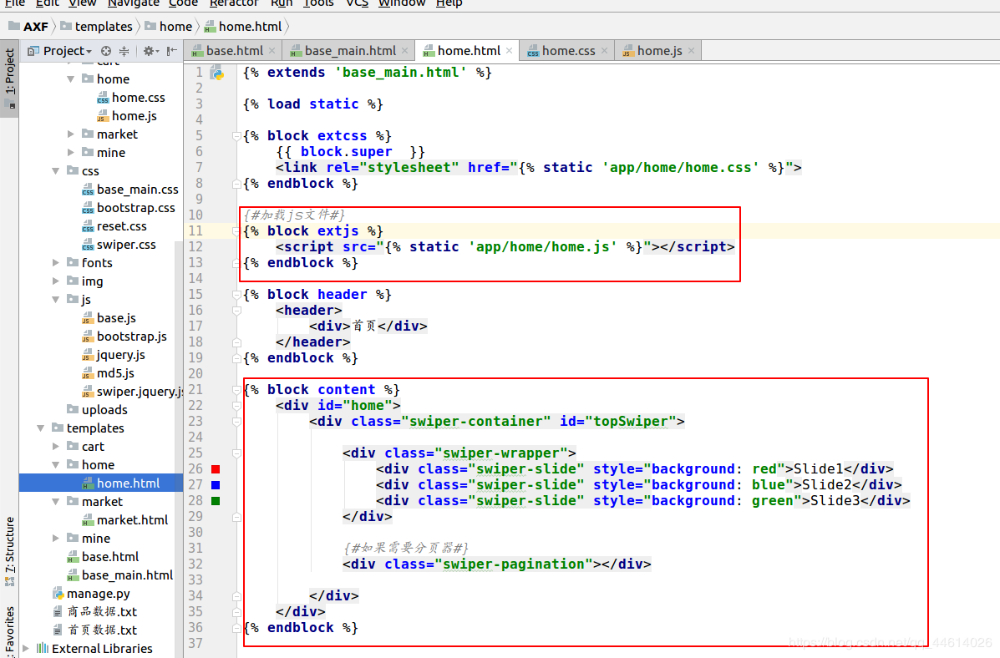

这个js文件可自己修改一下,需要的部分可自己添加,实现不同类型的轮播图效果

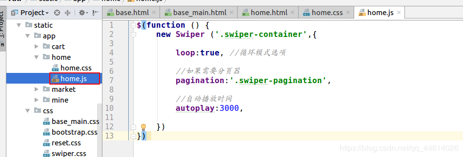

根据css样式,去网页看一下轮播图效果

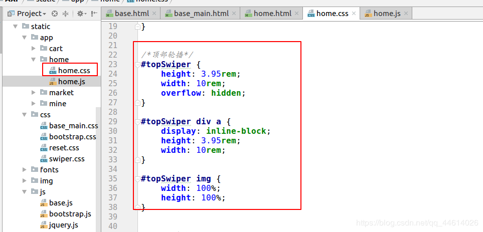

鼠标右击选中的轮播图部分,可以查看图片轮播时代码的变化

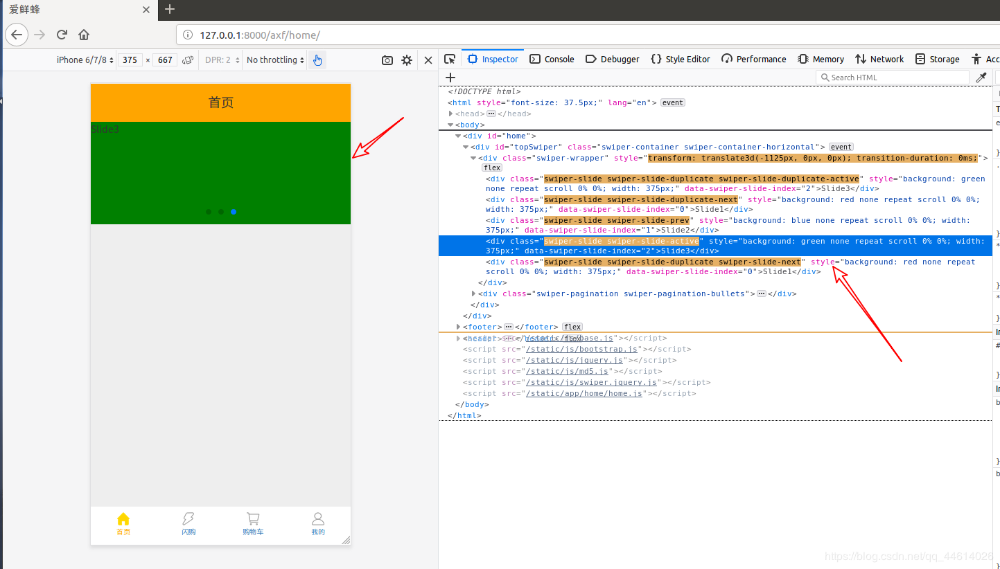

### 图片轮播这个功能就实现了接下来就是怎么从后端传入数据到页面上

在数据首页.txt文件查看数据,

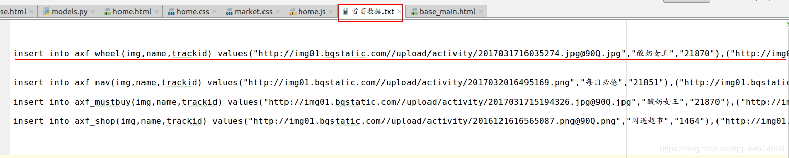

第一条数据就是关于轮播图的,将其复制到app下的models.py文件下查看(这里只是一条注释,便于查看后去创建模型,不在此文件中起任何作用),

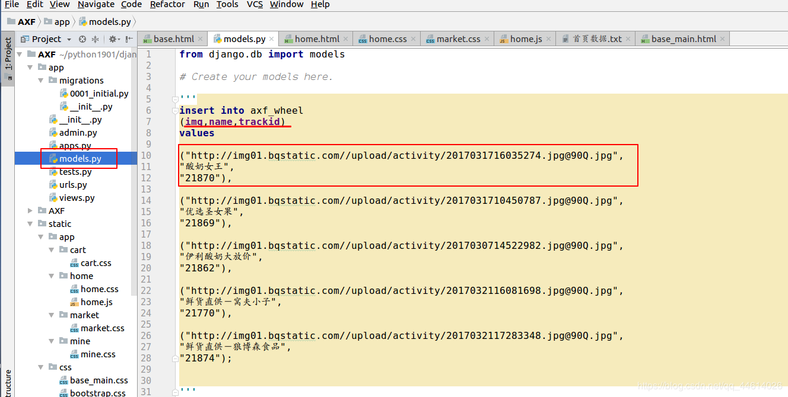

我们通过这条数据创建轮播图的模型

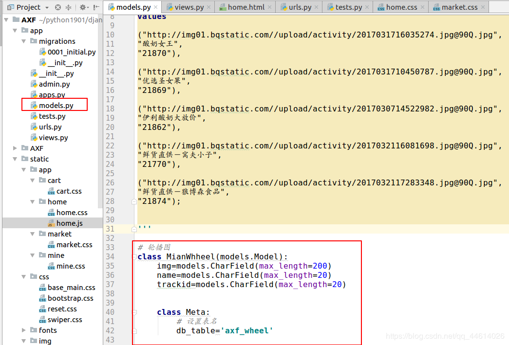

然后去views.py文件中去导入这个模型,渲染到home.html页面上

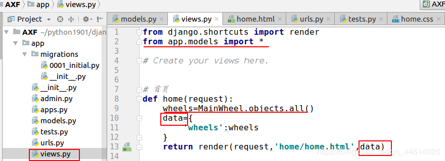

然后去修改一下home.html页面

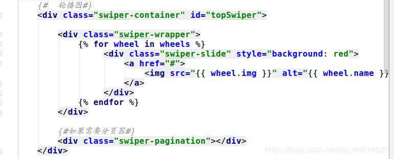

做一下数据迁移,

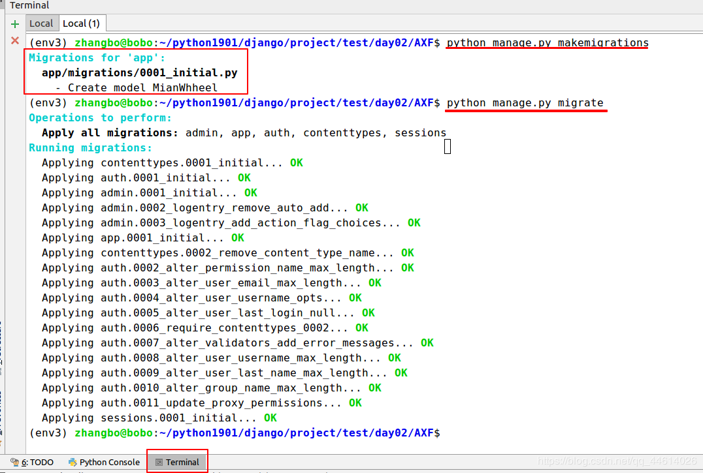

python [manage.py](http://manage.py/) makemigrations,产生了一个中间文件

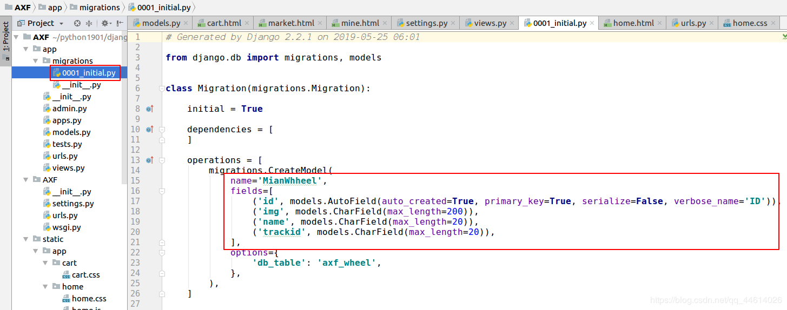

python [manage.py](http://manage.py/) migrate,查看一下数据库,可以看到数据库中创建了一些表,我们创建的模型就是这个表

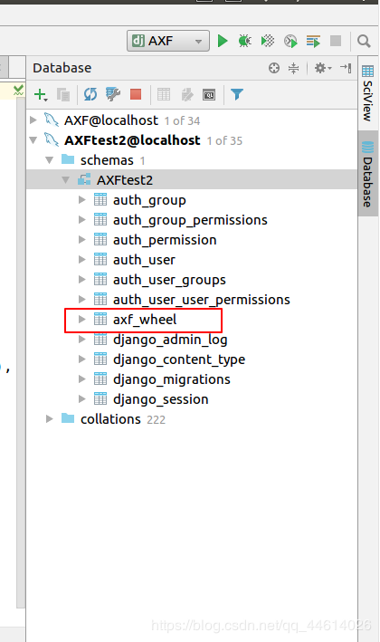

去数据库中插入一些轮播图图片的数据,这里选择去Ubuntu终端,打开mysql数据库插入

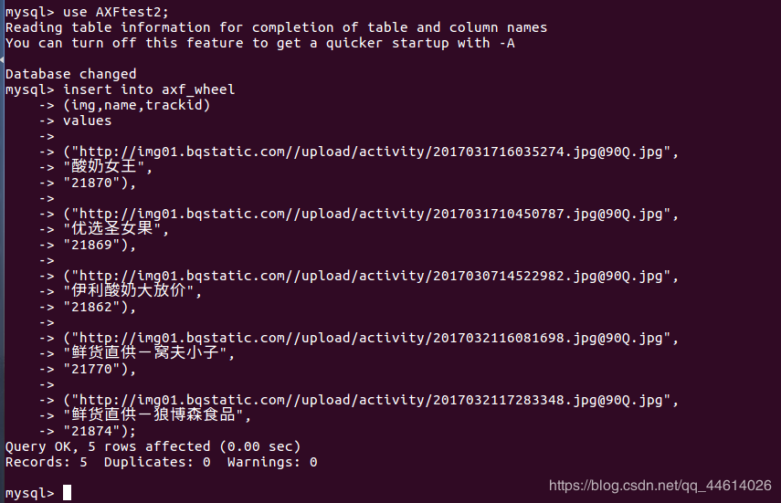

其实插入的数据就是这些,我们在上面提到过的**首页数据.txt**文件中的第一条

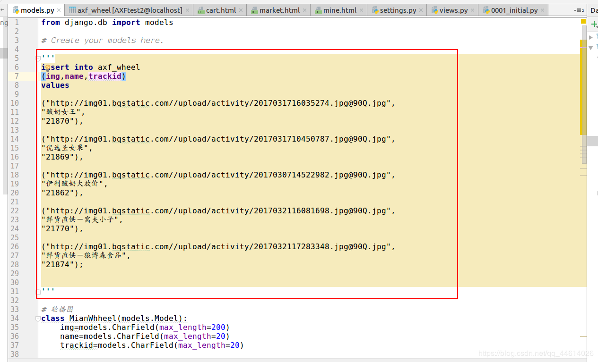

也可以去看一下这个表,看是否数据成功插入(有时会有延迟,点一下刷新按钮)

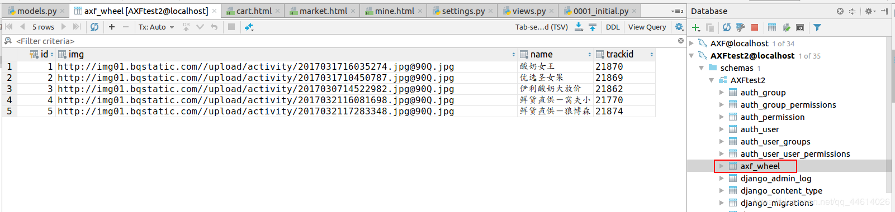

查看一下页面效果,可以看到,数据就传过来了,这个轮播图模块就完成了

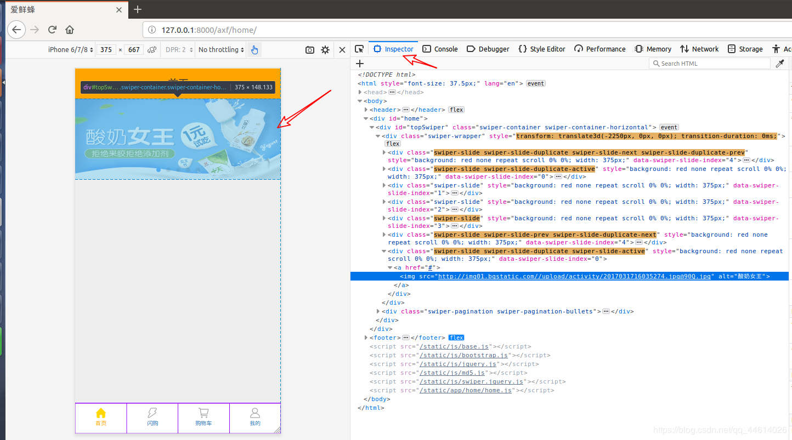