# 在框架上搭好基本的页面

# 1. home页面

## 1.2 轮播图 导航 必买 商店

home页面除了轮播图,还有导航,必买,商店等模块

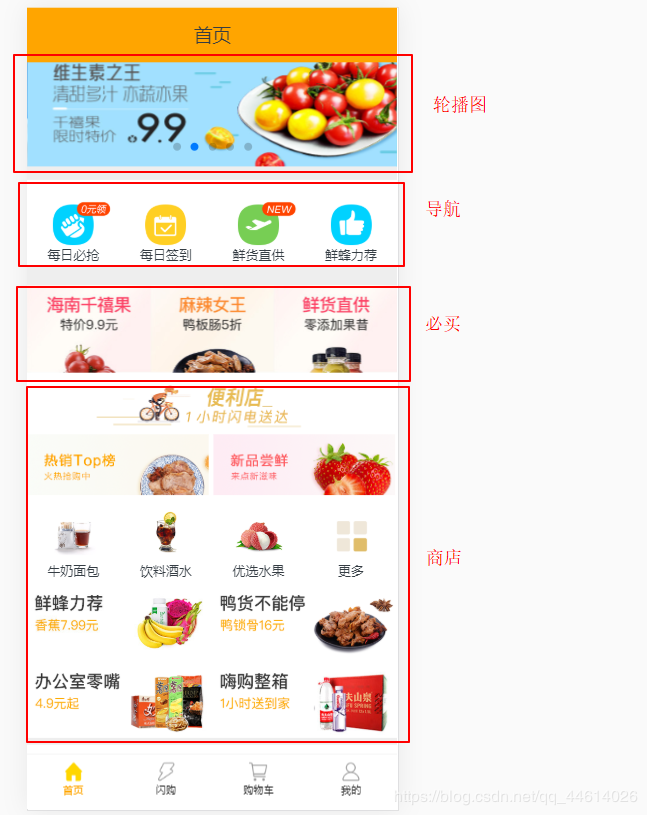

通过首页数据.txt文件,可以发现,这些数据都具有相同的属性,所以,他们的模板内容都相同,可以创一个**父模板**,轮播图,导航,必买,商店这些可以继承父模板的内容,这样更加简洁

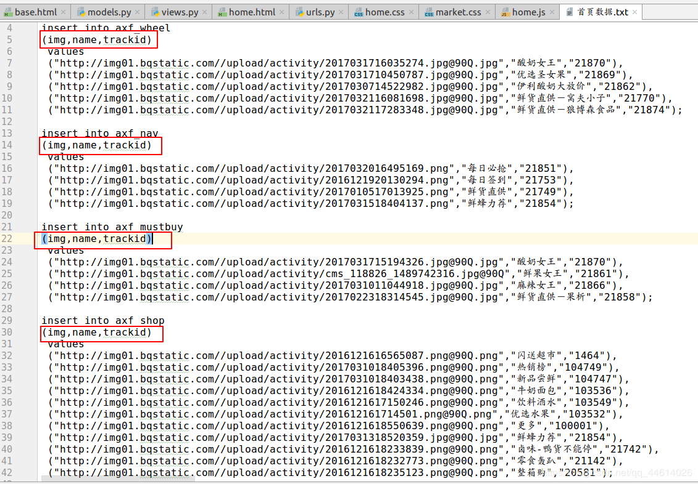

### 轮播图 导航 必买 商店 模型的创建

在models.py文件中,正常情况下每创建一个模型,在数据库中都会新产生一个表,而这里不需要父模板产生表,所以,在父模板中加入**abstract=True**

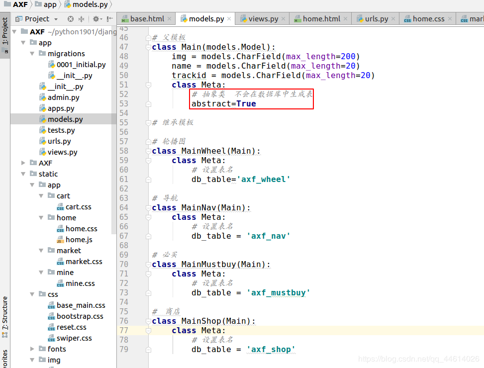

然后再去做一下数据迁移
**python manage.py makemigrations** 产生了一个中间文件
**python manage.py migrate** 然后查看一下数据库,可以看到数据库中新增了一些表

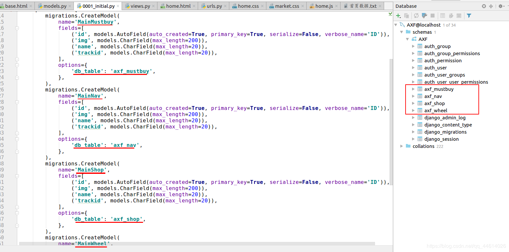

#### 导航

先去去views.py文件将导航的模型导入,渲染到home.html页面上

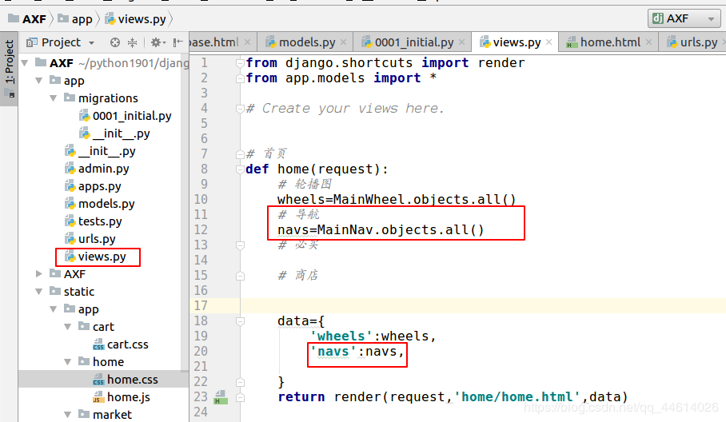

根据css样式

写一下home.html这个页面的导航

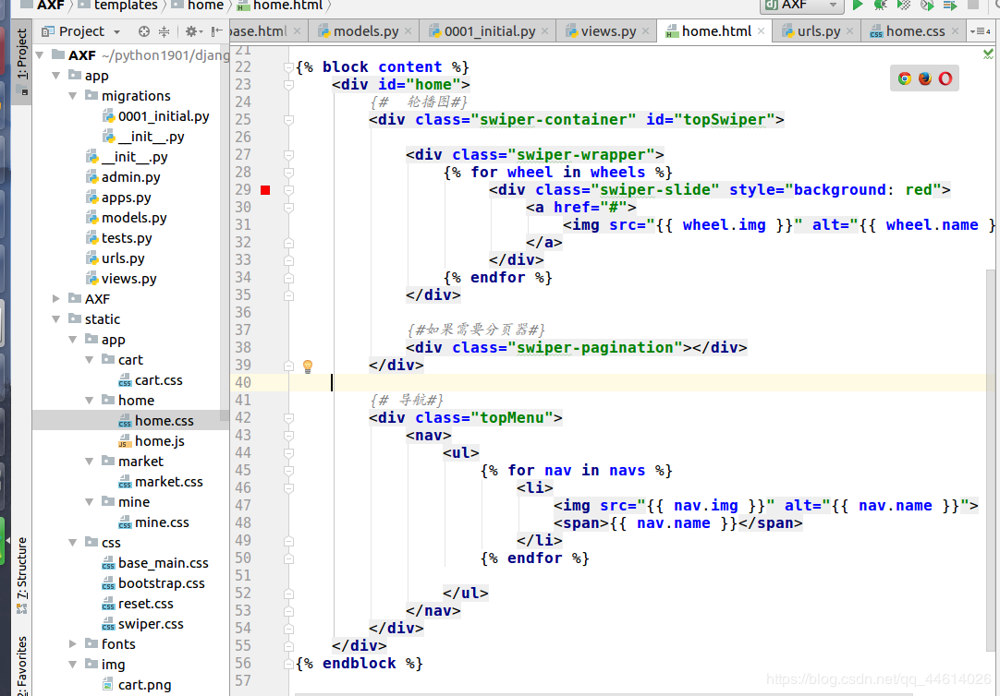

去Ubuntu终端,连接上使用的mysql数据库,插入提到过的首页数据.txt文件中的第二条:i**nsert into axf_nav…**
然后刷新一下网页,可以看到页面上导航就显示出来了

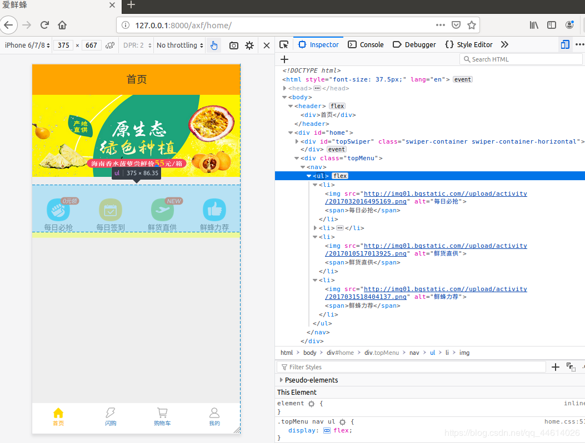

必买和商店与前面步骤相同,只需要修改一些样式

#### 必买

先去去views.py文件将必买的模型导入,渲染到home.html页面上

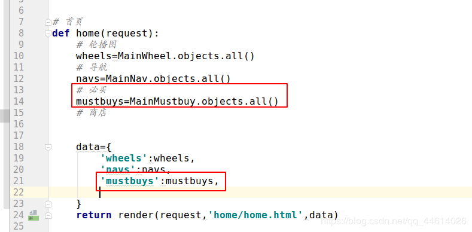

根据css样式,写一下home.html这个页面的 **必买** 模块

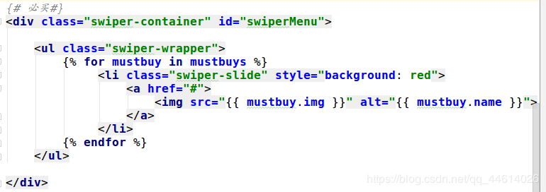

这里可以再修改一下js样式,这样就能显示3张图片,每隔3秒从右往左变换一张图片

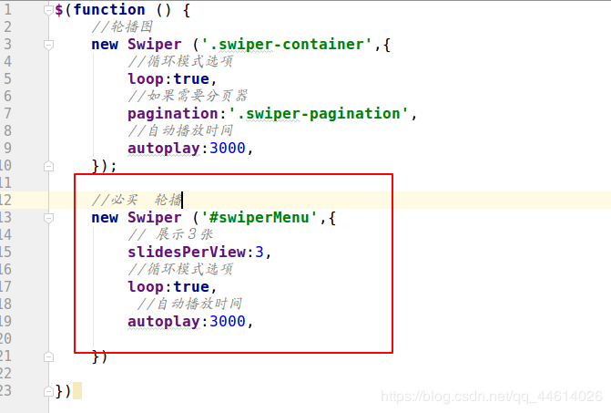

去Ubuntu终端,连接上使用的mysql数据库,插入提到过的首页数据.txt文件中的第三条:i**nsert into axf_mustbuy…**
然后刷新一下网页,可以看到页面上 **必买** 模块就显示出来了

#### 商店

这是商店展示的页面,这里的模块分布有点特殊

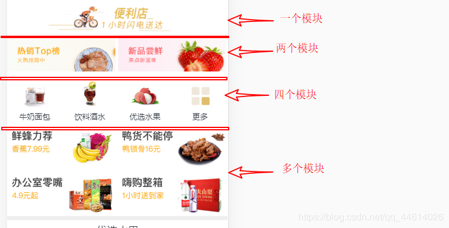

先去views.py文件将商店的模型导入,渲染到home.html页面上
商店这边的views视图函数也有点特殊,这个商店部分共四个模块,第一个模块一张图,第2个模块2张图,第3个模块3张图,第4个模块4张图,
所以根据取列表的参数的方式 shops[0]是第一个, shops[1:3]是第2,3个, shops[3:7]是第4 ~7个shops[7:11]是第8 ~11个,

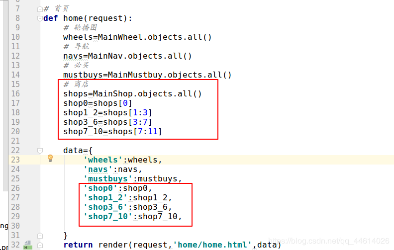

根据css样式,写一下home.html这个页面的 **必买** 模块

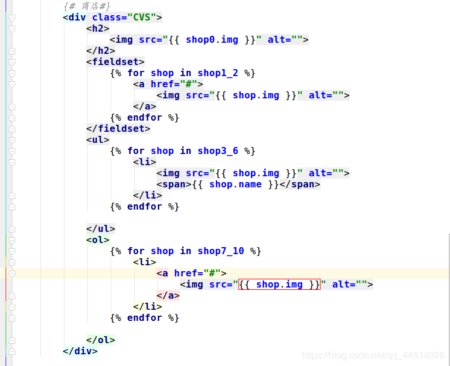

去Ubuntu终端,打开mysql数据库插入提到过的首页数据.txt文件中的第三条:i**nsert into axf_shop…**
然后刷新一下网页, 最后,我们来展示一下最终的页面效果

