# 在框架上搭好基本的页面

# 1. home页面

## 1.3 商品分类专栏

首页下还有一部分的**商品分类**专栏,这里给的数据是一样的,只是专栏名称不一样,因为这里的样式都是同一种样式,所以也没关系

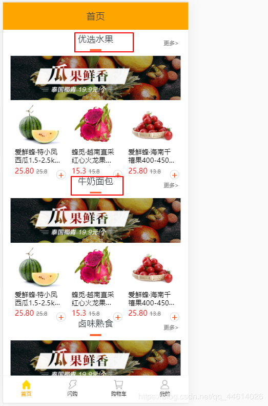

### 创建模型,插入数据

首先将txt文件里的数据弄出来,

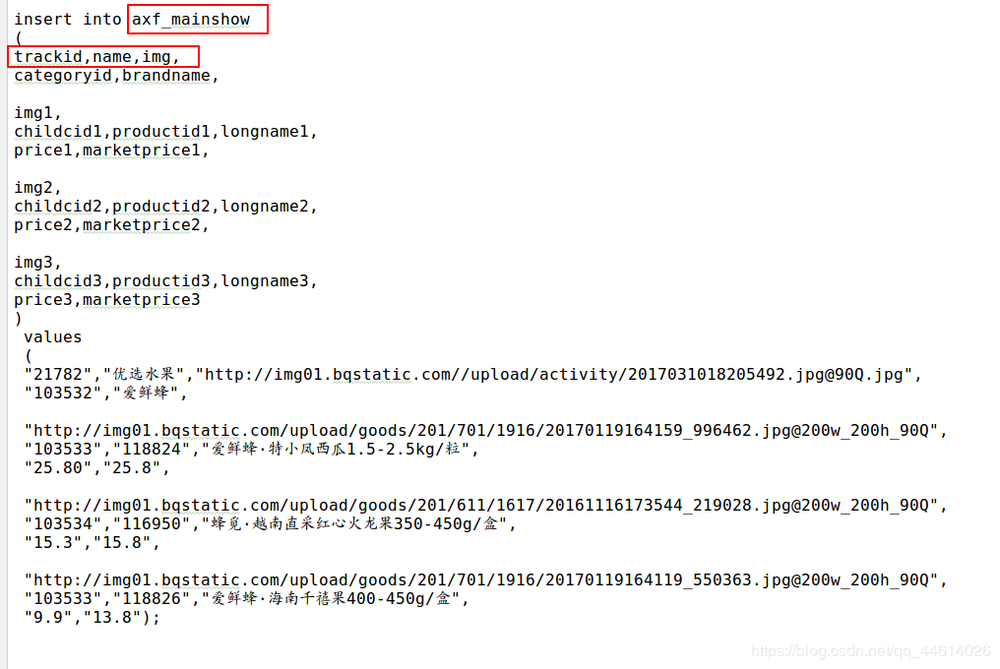

去整理一下数据,


可以看到,这一部分的数据和前面的轮播图,导航栏等有相同的字段**trackid,name,img**,
所以,这里创建模型的时候,也可以**继承父模板Main**,然后在多加一些内容
去views.py文件下写一下模型,对比父模板,多出来的这些字段,给它添加一下,同样最后自定义它的表名

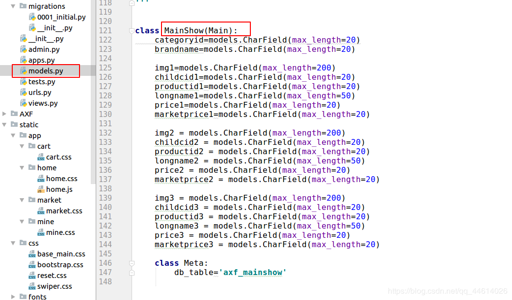

然后
做一下数据迁移

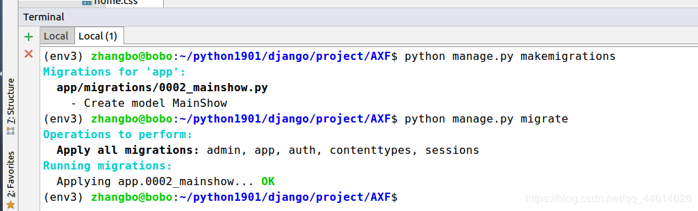

可以去查看一下产生了一个中间文件,然后数据库中多了一个表,这里就不列出来了,方法和前面一样
然后将数据插入到数据库中,可以和前面一样,在Ubuntu终端打开mysql数据库插入,还有一中方法是在pycharm中操作,

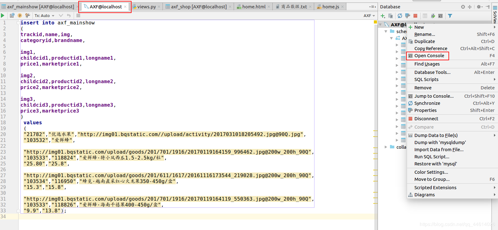

输入txt文件中的插入语句,点一下左上角的绿色小三角形,然后可以去查看一下

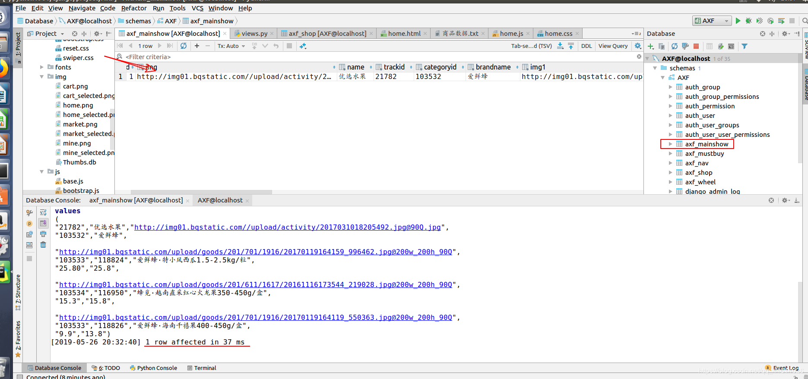

### 展示到home.html页面

先在views.py文件下去写一下视图函数

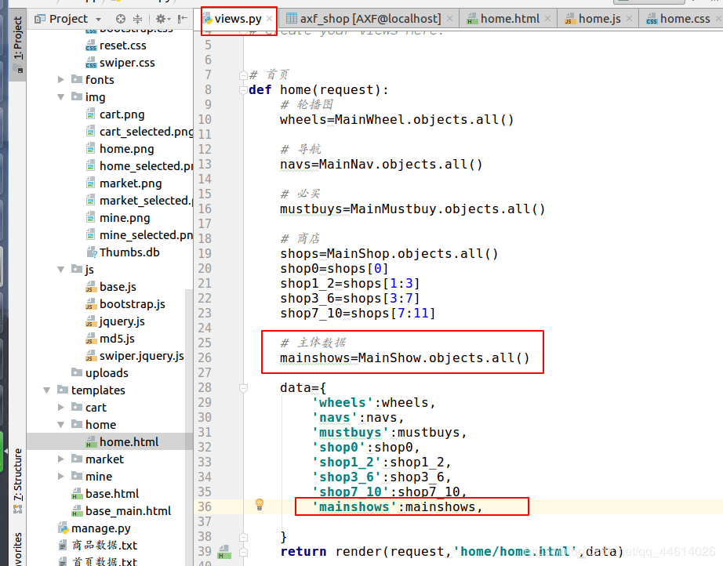

根据css样式和数据,

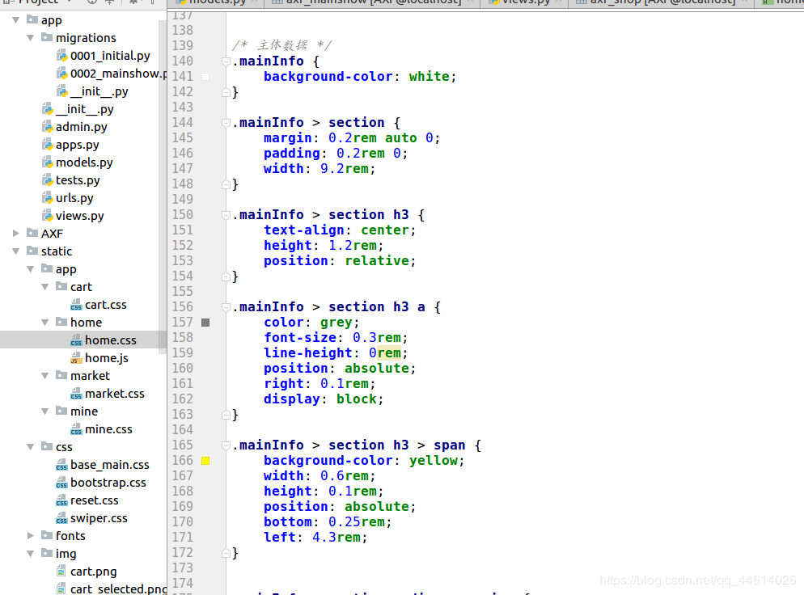

写一下home.html页面

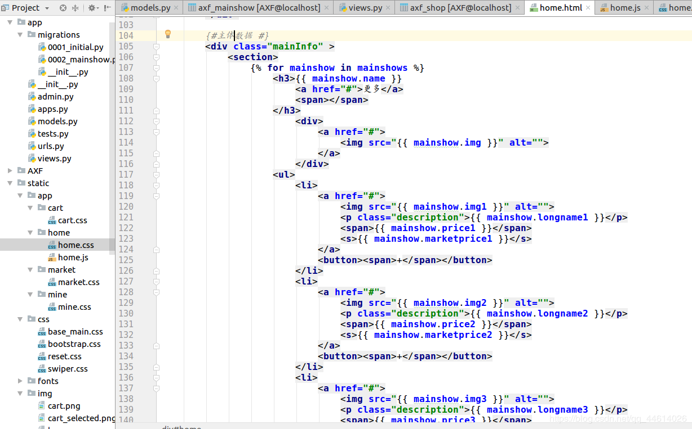

展示一下页面(简要概括一下页面信息)

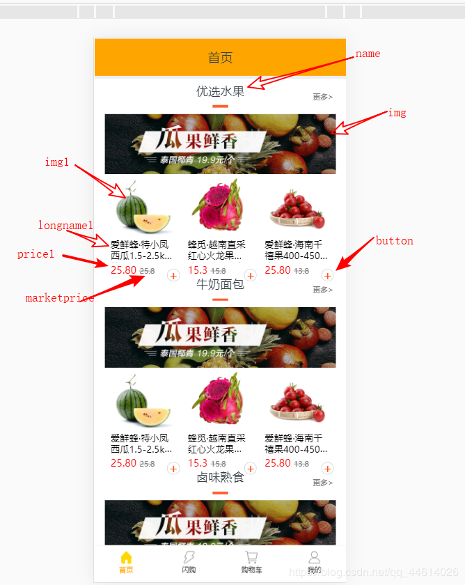

首页页面的一些基本内容到此就写完了 ,如果页面出现一些模块显示不正常的问题,bootstrap网站有专门关于移动端适配的内容
简要列出处理的方法
在base.html页面加入两行代码

```python
<meta http-equiv="X-UA-Compatible" content="IE=edge">
<meta name="viewport" content="width=device-width, initial-scale=1">
```

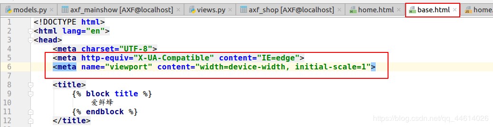

文件链接

链接：https://pan.baidu.com/s/1Kt8zybiQRcRCedGZymLUpQ

提取码：8rw8


