# 在框架上搭好基本的页面

# 2. cart页面

## 1.页面

首先来了解一下这个页面的功能,大家可以联想一下淘宝和其他购物app,首先进入这个页面,默认是跳到热销榜的内容,然后可以根据类型去排序,点击相应的按键会显示不同的内容

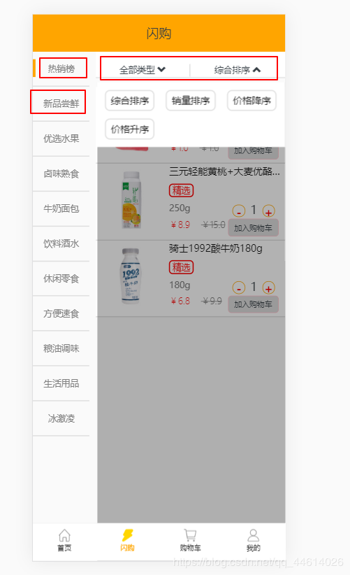

这张表是分类之间的一些基本的关联

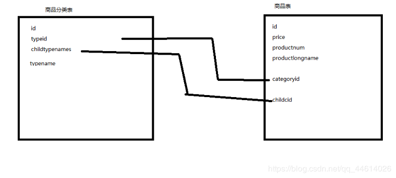

#### 创建模型

##### 页面左边的商品分类

首先将首页数据.txt文件里的最后一条数据取出来,观察一下规律
去views.py文件写一下模型

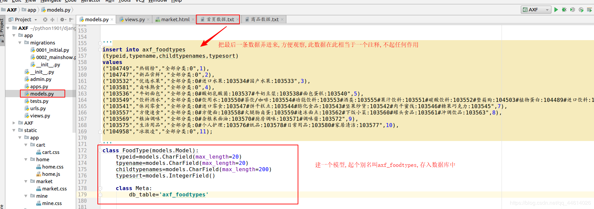

然后做一下数据迁移,产生一个中间文件,在数据库中创建了一个新的表

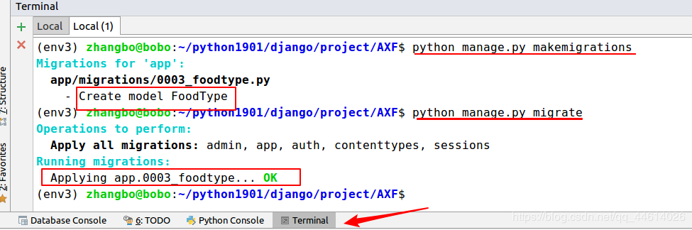

打开终端,插入这张表的数据

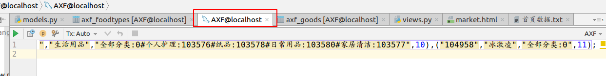

查看一下数据

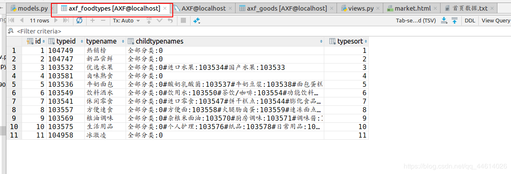

写一下页面

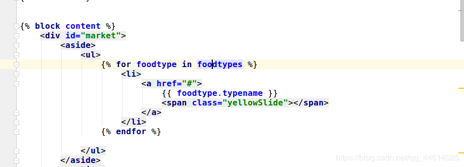

查看一下页面,商品分类,这里后面还需要修改一些css样式,点击的时候左端的橙色条会根据点击出现在相应的位置

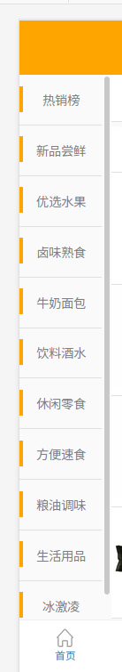

##### 根据商品的分类取出相关数据

现在去看一下商品数据.txt文件,将第一条数据取出来,观察一下规律
去views.py文件写一下模型

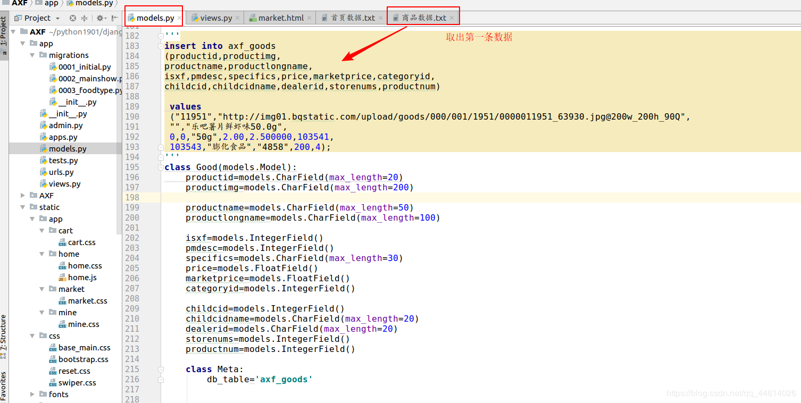

做一下数据迁移

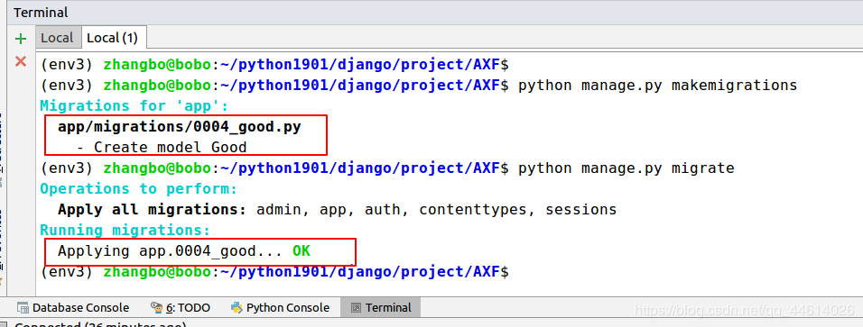

将商品数据.txt文件中的数据全部插入,这里不推荐使用用pycharm插入,如果数据太多,pycharm插入数据耗时太长,可在Ubuntu终端打开mysql选择使用的数据库插入数据

#### 将数据渲染到页面上

写一下视图函数

再写一下页面
其中,向下的箭头是一个组件,去bootstrap网站组件去找

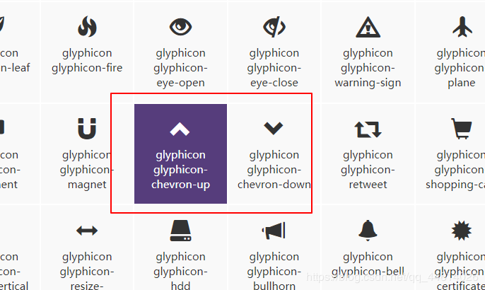

https://v3.bootcss.com/components/
根据css样式写一下页面,右边这块页面分为导航

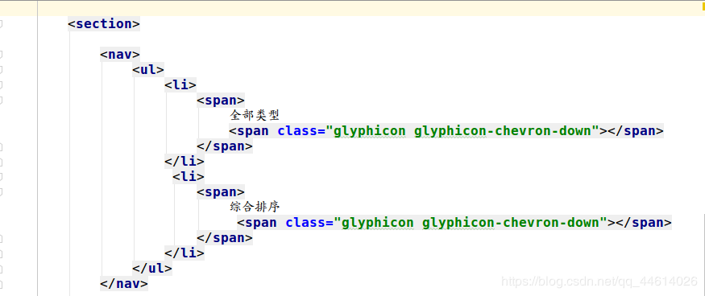

和内容两部分

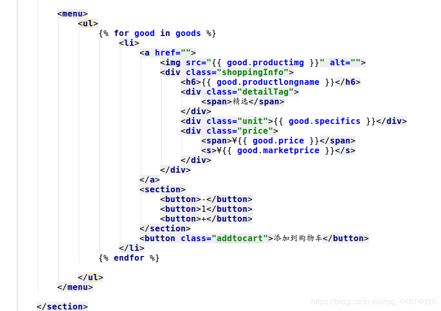

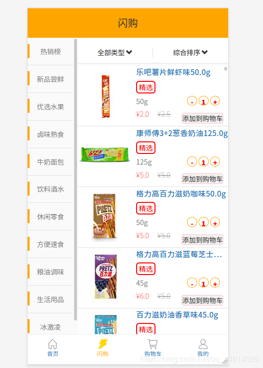

看一下页面效果,
初步页面效果就是这样,后面去添加和修改,实现相应的功能,通过点击左边的分类和右边导航栏的按钮筛选相应的信息

