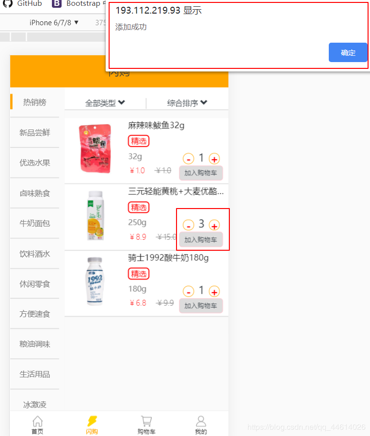
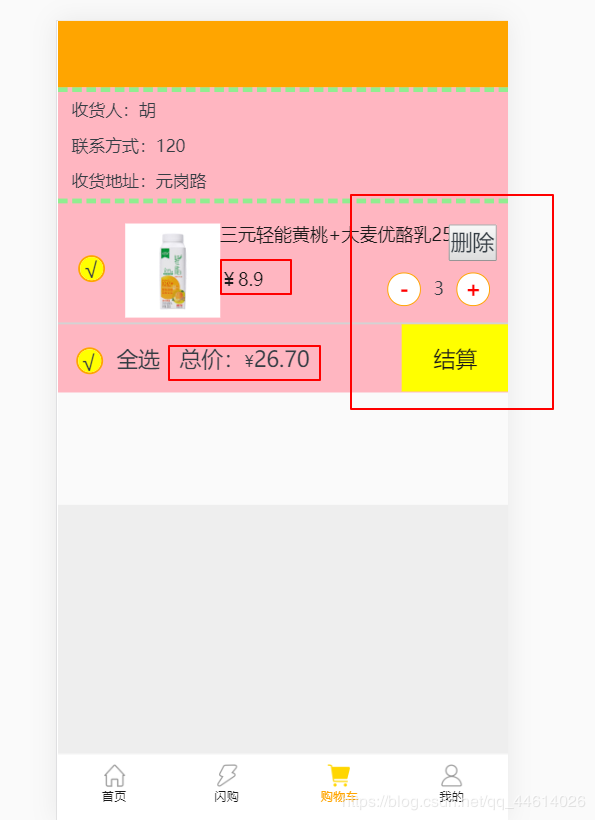
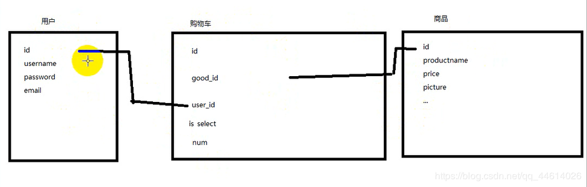
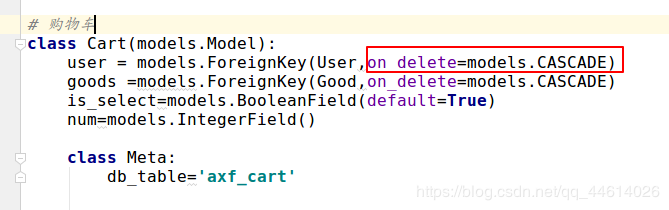
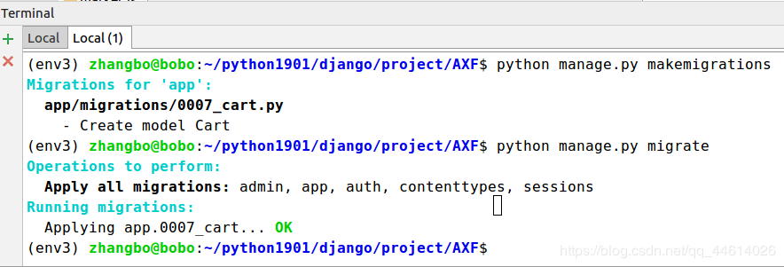
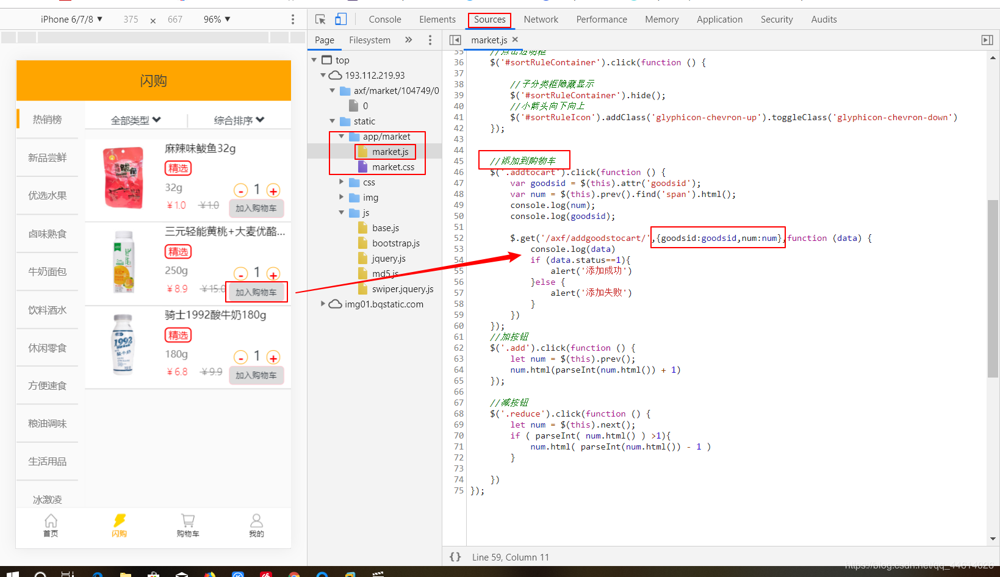
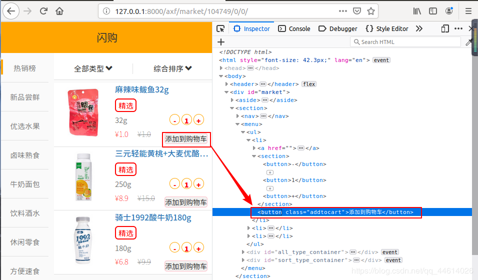

# 在框架上搭好基本的页面

# 4. 购物车页面添加商品

可以联想一些在app上购物流程,
先在商品页添加到购物车,

然后从购物车结算,

考虑一下这其中有哪些步骤,有哪些模块,该怎么去实现这些功能

## 4.1表的关联

商品,购物车,用户之间,可以转换为表的关联,购物车相当于中间表的角色,用户和商品之间成为多对多的关系

首先去models.py文件下写一下购物车的模型

外键关联到用户和商品,采用级联删除,当购物车中删除的时候,用户也删除相关信息

做一下数据迁移,在数据库中创建关于购物车的表

## 4.2 商品id,数量num

(小技巧,浏览网页时,可以去查看前端的代码)

当点击购物车的时候,发起了一个Ajax请求,通过js样式,把good_id ,num 在后台把用户进行关联

### 4.2.1取到id和num

首先在闪购页面market.html,
当点击添加到购物车按键时,把商品的id放在这个按钮上

